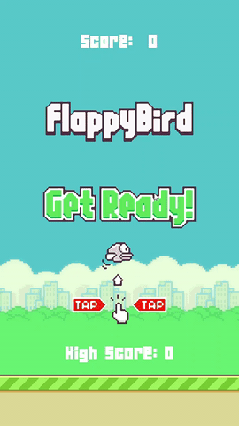

# Flappy Bird Clone

The purpose of this code is to emulate the popular mobile game Flappy Bird. It uses pygame to implement the GUI. 

Assets were borrowed from [Samuel Custodio](https://github.com/samuelcust/flappy-bird-assets). 

